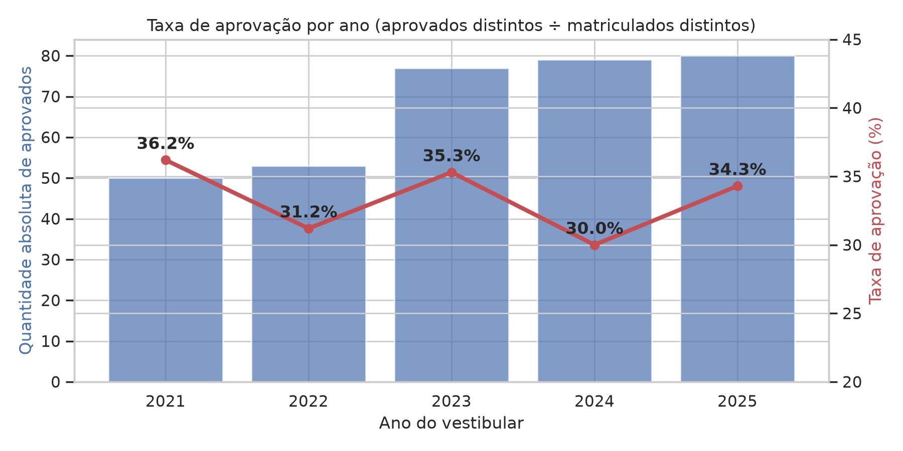
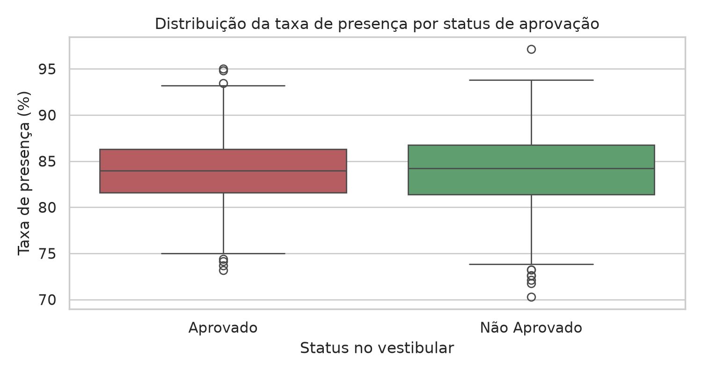
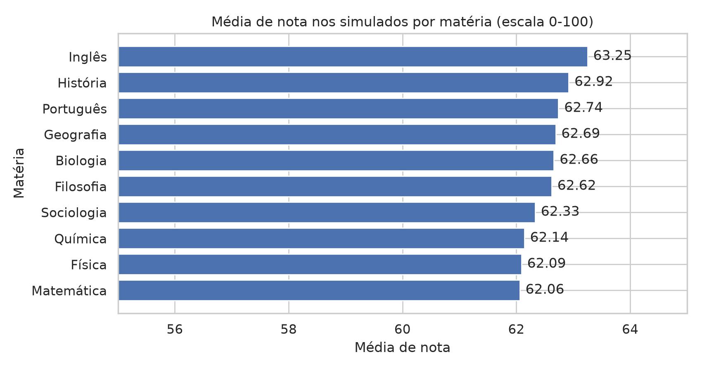
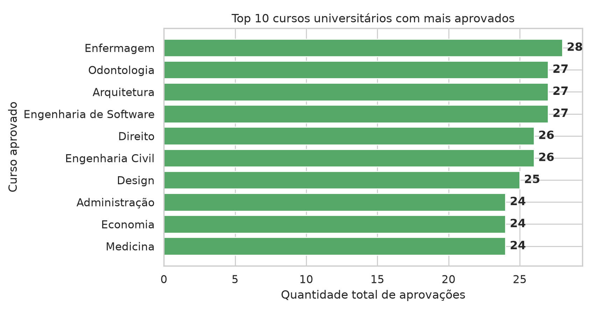
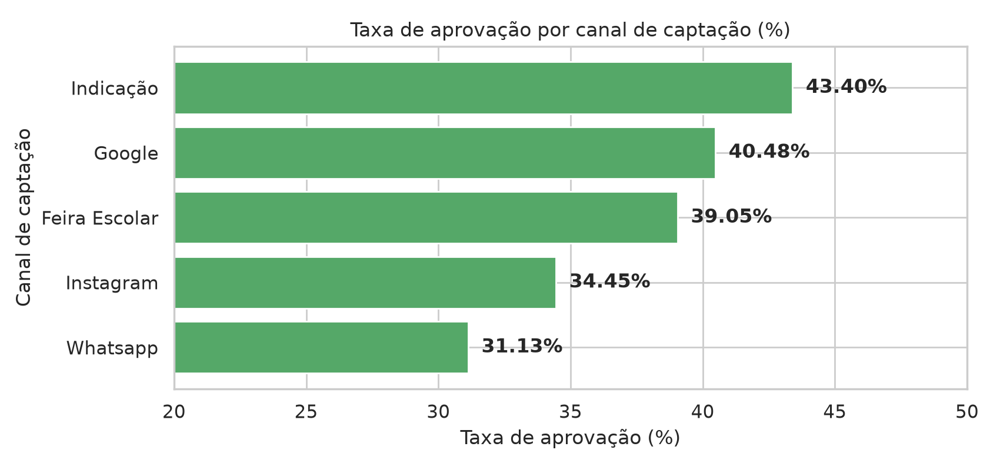
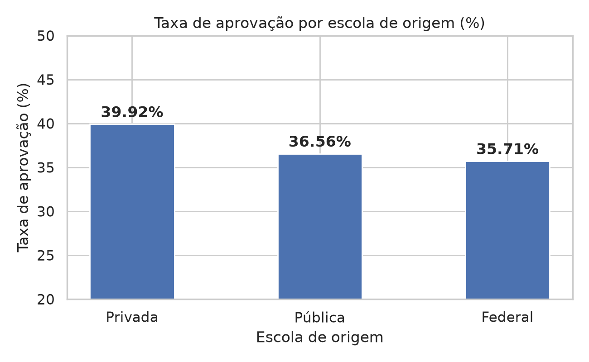
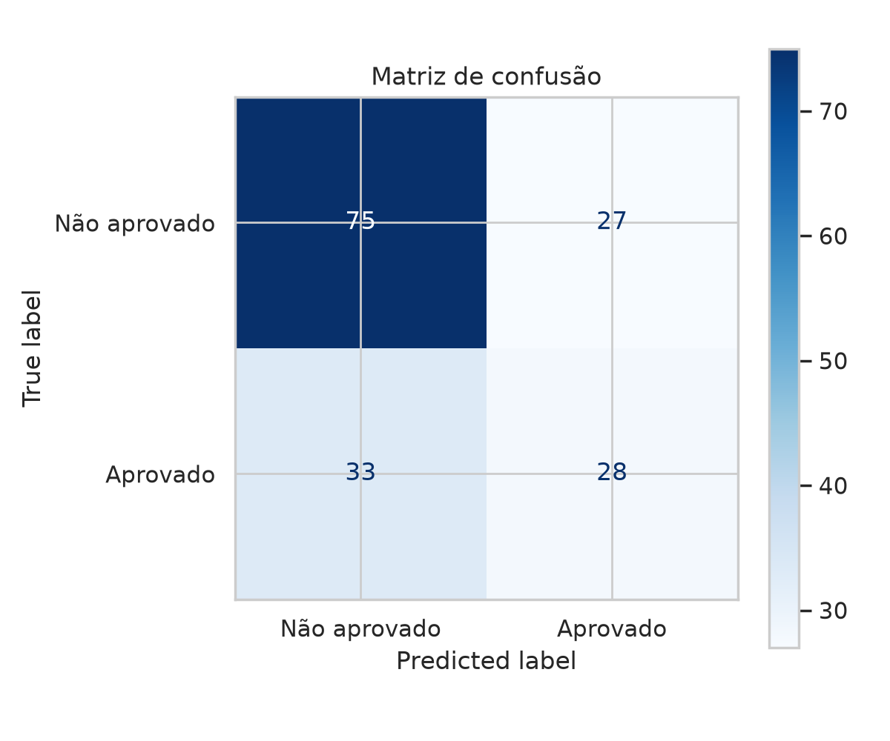
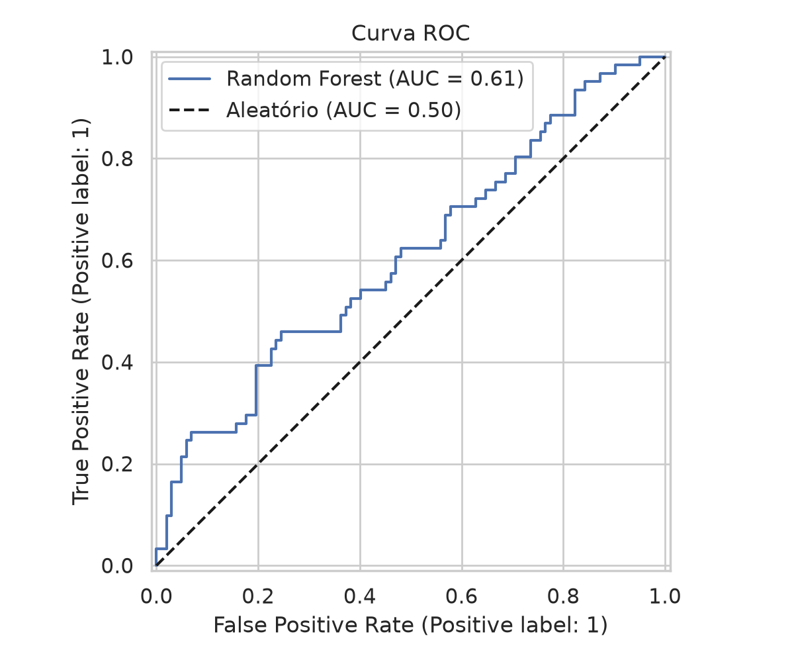
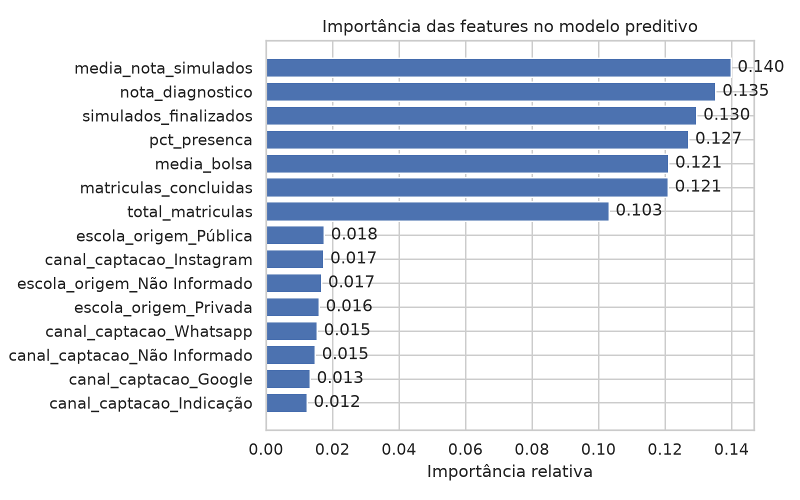

# Relatório Final Executivo & Técnico - AprovaEdu Analytics

---

## 1. Sumário Executivo
Este relatório sintetiza a solução analítica desenvolvida para a **AprovaEdu Analytics**, cobrindo 5 anos de dados operacionais e pedagógicos (2021–2025). O objetivo é apoiar a coordenação pedagógica na compreensão da evolução das aprovações no vestibular, no impacto da frequência escolar, no desempenho por curso/matéria e na identificação de recomendações estratégicas baseadas em dados.

---

## 2. Diagnóstico da Base Bruta e Qualidade dos Dados

A análise inicial identificou 9 tabelas relacionais com excelente integridade referencial entre as chaves (`aluno_id`), sem inconsistências de relacionamento. No entanto, foram identificados e tratados os seguintes problemas de qualidade de dados:

- **Inconsistências Categóricas**: Variações de caixa e ortografia em nomes de matérias (mais de 28 variações para 11 matérias reais), universidades (`uece`, `Ufc` vs `UECE`, `UFC`), escolas de origem e cidades.
- **Heterogeneidade de Datas**: Formatos mistos de datas (`YYYY-MM-DD`, `MM-DD-YYYY` e `DD/MM/YYYY HH:MM`) padronizados para o padrão ISO 8601.
- **Registros Suspeitos**: Remoção (deduplicação) de 15 aprovações marcadas com o rótulo `"Cadastro duplicado?"` após investigação comprovar que eram lançamentos repetidos.
- **Tratamento de Nulos**: Preenchimento de nulos categóricos com `"Não Informado"` e presenças ausentes sem distorção dos cálculos de médias acadêmicas.

---

## 3. Respostas às Análises Obrigatórias

### 3.1. Evolução da Taxa de Aprovação ao Longo dos Anos

Para garantir a transparência da análise e um denominador auditável, apresento as contagens intermediárias lado a lado:

| Ano | (1) Matriculados Distintos | (2) Aprovações Brutas | Aprovações Após Dedup | (3) Aprovados Distintos | Taxa de Aprovação = (3 ÷ 1) |
|:---:|:-------------------------:|:---------------------:|:---------------------:|:-----------------------:|:---------------------------:|
| **2021** | 138 | 50 | 50 | 50 | **36,2%** |
| **2022** | 170 | 53 | 53 | 53 | **31,2%** |
| **2023** | 218 | 78 | 77 | 77 | **35,3%** |
| **2024** | 263 | 87 | 79 | 79 | **30,0%** |
| **2025** | 233 | 86 | 80 | 80 | **34,3%** |

- **Metodologia de Cálculo**: A taxa correta é calculada dividindo **Aprovados Distintos (3)** por **Matriculados Distintos (1)**, garantindo que o numerador e o denominador meçam pessoas (e não contagem de eventos).
- **Impacto da Deduplicação**: O volume de aprovações brutas (354 no total) cai para 339 após a remoção das 15 duplicidades de cadastro. Após essa limpeza, o volume de aprovações coincide exatamente com os alunos aprovados distintos por ano.
- **Movimentos Observados**:
  1. A taxa de aprovação é **estável na casa de 30% a 36%** (média de 33,4%), sem tendência forte de queda ou alta.
  2. O que altera ao longo do tempo é a **escala da operação**: o volume de alunos matriculados quase dobra (138 → 263 no pico), e o volume de aprovações cresce proporcionalmente (50 → 80). A rede expandiu mantendo sua eficiência de aprovação.

---

### 3.2. Relação Entre Presença nas Aulas e Aprovação no Vestibular

- **Metodologia de Cálculo**:
  1. A taxa de frequência individual de cada estudante foi calculada pela razão:
     $$\text{Taxa de Presença (\%)} = \frac{\text{Total de Aulas ('Presente' ou 'Atrasado')}}{\text{Total de Aulas Registradas do Aluno}} \times 100$$
  2. Alunos com status `Presente` ou `Atrasado` foram contabilizados como presença efetiva em sala. Status `Ausente` e `Justificado` foram considerados ausências.
  3. Cada aluno (`aluno_id`) foi rotulado no grupo **Aprovado** (se possui pelo menos 1 registro em `aprovacoes_vestibular`) ou **Não Aprovado** (demais alunos).
  4. Calculou-se as estatísticas descritivas (média, mediana e desvio padrão) de frequência para cada um dos dois grupos.

- **Resultados Encontrados**:
  - **Aprovados**: Frequência média em aula de **83,97%** (mediana 83,97%, desvio padrão 3,84%)
  - **Não Aprovados**: Frequência média em aula de **84,03%** (mediana 84,21%, desvio padrão 4,26%)

- **Conclusão de Negócio**: A presença em aula é uma condição necessária para o acompanhamento dos conteúdos, porém **não é isoladamente suficiente para garantir a aprovação**. Outros fatores como desempenho prático nos simulados, estudo individual e assimilação do bloco de Exatas/Natureza exercem peso decisivo.

---

### 3.3. Cursos e Matérias com Melhor e Pior Desempenho

- **Metodologia de Cálculo**:
  1. **Desempenho por Matéria**: Calculou-se a nota média de cada disciplina a partir da tabela `resultados_simulados` cruzada com `simulados`, filtrando exclusivamente realizações com `status_realizacao = 'Finalizado'`:
     $$\text{Média da Matéria} = \frac{\sum \text{Notas dos Simulados Finalizados}}{\text{Total de Realizações na Matéria}}$$
     *Nota*: A *Redação* é avaliada na escala $0\text{--}1000$ (padrão ENEM), enquanto as demais disciplinas objetivas utilizam a escala $0\text{--}100$.
  2. **Ranking por Cursos Universitários**: Agrupou-se a tabela `aprovacoes_vestibular` por `curso_aprovado` contando a quantidade total de aprovações e o total de alunos distintos.

- **Matérias com Maior Nota Média nos Simulados**:
  - *Redação*: **718,65** (escala ENEM 0-1000)
  - *Inglês*: **63,25**
  - *História*: **62,92**
- **Matérias com Menor Nota Média (Gargalos Pedagógicos)**:
  - *Matemática*: **62,06**
  - *Física*: **62,09**
  - *Química*: **62,14**

- **Top 5 Cursos Universitários com Mais Aprovados**:
  1. Enfermagem (28 aprovações)
  2. Odontologia (27 aprovações)
  3. Engenharia de Software (27 aprovações)
  4. Arquitetura (27 aprovações)
  5. Engenharia Civil (26 aprovações)

---

### 3.4. Recomendações Práticas para a Coordenação Pedagógica

1. **Oficinas de Reforço em Exatas e Natureza**: Criar módulos de nivelamento focados em *Matemática, Física e Química*, identificados como as matérias de menor rendimento médio nos simulados.
2. **Painel de Risco Preditivo (Além da Lista de Chamada)**: Implementar monitoramento contínuo das notas de simulados, pois a presença em aula isolada não diferencia alunos em risco de retenção.
3. **Planos de Estudo por Carreira**: Oferecer listas de questões focadas nas bancas e pesos dos cursos mais procurados (Engenharia de Software, Odontologia, Enfermagem e Direito).
4. **Manutenção da Matriz de Redação e Humanas**: Preservar as oficinas de redação que atualmente lideram os indicadores de desempenho.

---

### 3.5. Análises Extras Estratégicas: Canais de Captação e Perfil de Origem

Para ir além das perguntas obrigatórias e gerar inteligência estratégica para os times de **Marketing, Vendas e Gestão**, realizei duas análises complementares:

#### **A. Eficiência dos Canais de Captação (Marketing vs Qualidade da Aprovação)**
Avaliei a taxa de aprovação no vestibular de acordo com a origem do cadastro do estudante:

| Canal de Captação | Total de Estudantes | Alunos Aprovados | Taxa de Aprovação (%) |
|:-----------------:|:-------------------:|:----------------:|:---------------------:|
| **Indicação** | 106 | 46 | **43,40%** |
| **Google** | 126 | 51 | **40,48%** |
| **Feira Escolar** | 105 | 41 | **39,05%** |
| **Instagram** | 238 | 82 | **34,45%** |
| **WhatsApp** | 106 | 33 | **31,13%** |

* **Insight Estratégico**: Alunos vindos de **Indicação** possuem a maior taxa de aprovação no vestibular (**43,4%**), demonstrando que o "boca a boca" atrai estudantes mais engajados e alinhados com o cursinho. Por outro lado, campanhas de redes sociais (Instagram e WhatsApp) trazem o maior volume absoluto de cadastros, mas menor conversão em aprovação (31,1% a 34,4%).
* **Recomendação**: Criar um **Programa de Indicação de Alunos Veteranos** (com descontos ou benefícios na mensalidade) para aumentar o volume do canal de maior eficiência.

#### **B. Impacto da Escola de Origem (Pública, Privada e Federal)**
Avaliei o desempenho no vestibular conforme a formação escolar prévia dos alunos:

| Escola de Origem | Total de Estudantes | Alunos Aprovados | Taxa de Aprovação (%) |
|:----------------:|:-------------------:|:----------------:|:---------------------:|
| **Privada** | 248 | 99 | **39,92%** |
| **Pública** | 227 | 83 | **36,56%** |
| **Federal** | 112 | 40 | **35,71%** |

* **Insight Estratégico**: A diferença na taxa de aprovação entre alunos de *Escola Privada* (39,9%) e *Escola Pública* (36,6%) é de apenas **3,36 pontos percentuais**. Isso comprova que a proposta pedagógica do cursinho atua como um **eficiente equalizador social de oportunidades**, nivelando o conhecimento dos estudantes independente de sua origem.

---

## 4. Desempenho do Modelo Preditivo

### 4.1. Objetivo

Treinei um modelo de Machine Learning para prever se um aluno será **aprovado ou não** no vestibular, utilizando seus indicadores acadêmicos e comportamentais registrados no cursinho.

### 4.2. Escolha do Algoritmo: Random Forest

Optei pelo **Random Forest (Floresta Aleatória)** pelos seguintes motivos:

1. **Robustez**: Utiliza um ensemble de múltiplas árvores de decisão, o que reduz o risco de overfitting em comparação com uma árvore única.
2. **Interpretabilidade**: Fornece nativamente o ranking de **importância das features**, permitindo que a coordenação pedagógica saiba exatamente *quais variáveis monitorar com prioridade*.
3. **Flexibilidade**: Lida com features numéricas e categóricas sem necessidade de normalização ou padronização prévia dos dados.
4. **Adequação ao volume de dados**: Com 812 amostras, modelos mais complexos, como redes neurais, não teriam dados suficientes para justificar sua complexidade adicional.

### 4.3. Features Utilizadas (Variáveis de Entrada)

Cada feature foi escolhida por representar uma **dimensão distinta do comportamento acadêmico** do aluno:

| Feature | Dimensão que Representa | Origem no Banco |
|---|---|---|
| `pct_presenca` | Engajamento presencial | `presencas_aulas` |
| `media_nota_simulados` | Rendimento acadêmico direto | `resultados_simulados` |
| `simulados_finalizados` | Comprometimento com avaliações | `resultados_simulados` |
| `total_matriculas` | Volume de disciplinas cursadas | `matriculas` |
| `matriculas_concluidas` | Persistência e retenção | `matriculas` |
| `media_bolsa` | Perfil socioeconômico | `matriculas` |
| `nota_diagnostico` | Nível de entrada do aluno | `matriculas` |
| `escola_origem` | Background educacional | `estudantes` |
| `canal_captacao` | Perfil de engajamento | `estudantes` |

**Variável Alvo (Target)**: `aprovado` — 1 se o aluno possui pelo menos 1 registro em `aprovacoes_vestibular`, 0 caso contrário.

### 4.4. Resultados e Métricas

Configuração: 100 árvores, profundidade máxima 10, `class_weight="balanced"`, split 80/20 estratificado (`random_state=42`).

| Métrica | Valor |
|---|---|
| **Acurácia** | 63,19% |
| **F1-Score** (classe Aprovado) | 48,28% |
| **AUC-ROC** | 60,86% |

### 4.5. Importância das Features

**Interpretação**:
- As **features numéricas** dominam a importância do modelo: *média de nota nos simulados* (14,0%), *nota diagnóstico* (13,5%), *simulados finalizados* (12,9%) e *presença em aulas* (12,7%).
- As **features categóricas** (escola de origem, canal de captação) contribuem marginalmente (~1,2% a 1,7% cada).
- **Conclusão pedagógica**: O desempenho acadêmico prático (notas, participação em simulados, persistência nas matrículas) é o principal preditor de aprovação — não o perfil demográfico ou a origem do aluno.

### 4.6. Limitações do Modelo

- A acurácia de ~63% indica que o modelo tem capacidade limitada de discriminação, o que é esperado para dados educacionais onde muitos fatores externos (estudo individual em casa, motivação pessoal, dificuldade da prova) não são capturados pelo banco de dados do cursinho.
- O modelo deve ser interpretado como uma **ferramenta de apoio à triagem de risco**, não como um preditor absoluto.

---

## 5. Conclusões Gerais

Os resultados das análises obrigatórias, extras e do modelo preditivo confirmam a solidez operacional do cursinho e trazem direcionamentos claros:

1. **Para a coordenação pedagógica**: Reforço no bloco de Exatas (Matemática, Física e Química), monitoramento contínuo do desempenho em simulados (principal preditor de aprovação) e atenção especial à persistência dos alunos nas matrículas.
2. **Para o marketing**: Investir no canal de Indicação (43,4% de taxa de aprovação) e criar programas de incentivo ao boca a boca entre alunos veteranos.
3. **Para a gestão**: O cursinho atua como equalizador social (diferença de apenas 3,4% entre alunos de escola pública e privada) e o programa de bolsas não prejudica o desempenho geral.
